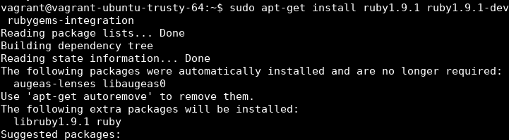
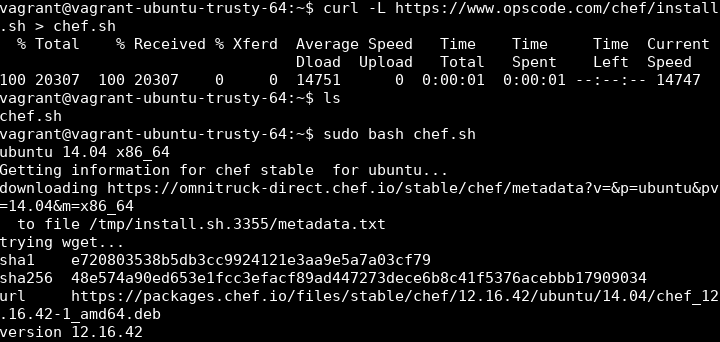

En primer lugar lo que he hecho ha sido configurar una máquina virtual con Vagrant esta máquina virtual es un ubuntu 64b:

```bash
mkdir ubuntu64
vagrant init ubuntu/trusy64
vagrant up
vagrant ssh
```
una vez tenemos conexión ssh con la máquina virtual vamos comprobamos que tiene instalado chef y vemos si tiene las gemas de ruby necesarias con el siguiente comando:

```bash
 gem list
 ```

en este caso vemos que no hay instalada ninguna gema de ruby en la máquina virtual. Lo que hacemos en primer lugar es desinstalar todos los componente que debíamos instalar con el ejercicio para instalarlos nuevamente.

```bash
 sudo apt-get purge ruby ruby1.9.1 chef chef-zero
 ```

 esto limpia toda la instalación Ruby de nuestra máquina (incluyendo el comando *gem* que nos permite gestionar las gemas de Ruby en nuestra máquina) así como *chef*. Y ahora procedemos a la instalación nuevamente con los comandos especificados.

 

Ahora vamos a proceder a instalar Chef debido a problemas de compatibilidad con las versiones de Ruby disponibles para la máquina virtual seleccionada he optado por instalar Chef con el script que se facilita en el tema. En caso de no valer dicha instalación pasaría a intentar instalar la versión 2.3 de Ruby en la máquina virtual siguiendo un [tutorial](https://www.brightbox.com/blog/2016/01/06/ruby-2-3-ubuntu-packages/).

 
