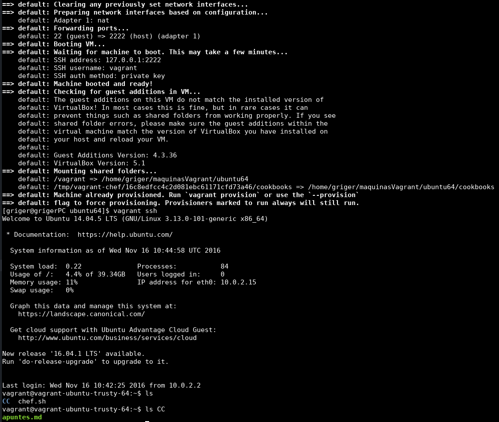

En el [ejercicio 2](ej2.md) ya hemos instalado una máquina virtual tipo Debian; en nuestro caso una máquina con Ubuntu (64b) y la hemos provisionado haciendo uso de Chef en combinación con Vagrant. Así que en este ejercicio sólo vamos a mostrar una captura de pantalla en la que se muestra cómo nos conectamos vía ssh a la máquina creada y cómo vemos el directorio y el archivo que hemos creado con la [receta chef](default.rb) que se creó como objetivo del ejercicio 2:

Las primeras líneas que observamos en la captura anterior se corresponden a mensajes de salida del comando `vagrant up` con el que "arrancamos" la máquina virtual desde el directorio donde esté el archivo *Vagrantfile* configurado para dicha máquina virtual. 
