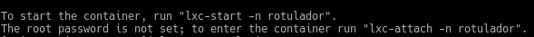

Hemos creado un contenedor Alpine con el comando `sudo lxc-create -t alpine -n lapiz` entonces para conectarnos lo que hacemos es usar el comando `sudo lxc-attach -n lapiz` y aquí vemos una captura de la consola de la que salimos con el comando `exit`:

Hemos de conectarnos de este modo a este contenedor ya que durante la creación no se le asigna una contraseña para el root, como sí sucede con un contenedor Ubuntu, y nos indica que se haga de este modo:

