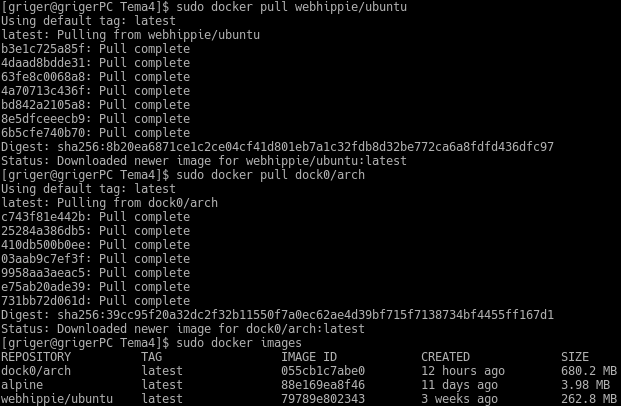

Lo primero que tenemos que hacer es instalar el módulo Arch que nos permite trabajar con Docker, teniendo en cuenta que Docker no soportar *host* de 32b. Para instalarlo empleamos el comando siguiente:

```bash
sudo pacman -S docker
```

Ahora tenemos que arrancar el servicio y comprobar que se funciona correctamente con los siguientes comandos:

```bash
sudo systemctl start docker
sudo docker info
```

El último comando hemos de ejecutarlo como superusuario ya que en otro caso, al no haber configurado los grupos necesarios para poder usar docker como un usuario normal, nos dirá que no puede conectar con Docker y nos dirá que comprobemos si su daemon está ejecutándose.

Pasamos ahora a instalar una imagen [alternativa de Ubuntu](https://hub.docker.com/r/webhippie/ubuntu/) y otra de [Arch Linux](https://hub.docker.com/r/dock0/arch/) con los comandos siguientes. Mostramos también una captura en la que se muestra la instalación de estas imágenes así como un listado de las imágenes instaladas en nuestra máquina por medio del comando `docker images`:

```bash
sudo docker pull webhippie/ubuntu
sudo docker pull dock0/arch
```


