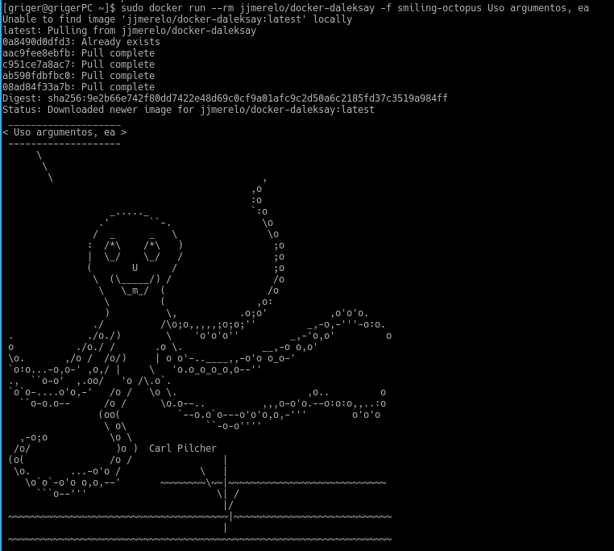
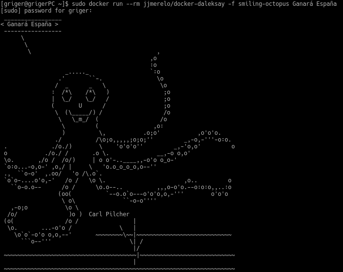

**Buscar alguna demo interesante de Docker y ejecutarla localmente, o en su defecto, ejecutar la imagen anterior y ver cómo funciona y los procesos que se llevan a cabo la primera vez que se ejecuta y las siguientes ocasiones.**

Lo que se hace la primera vez que ejecutamos el comando es descargar las distintas capas de las que está compuesto el contenedor ya que no disponemos de esta imagen, se crea el contenedor (aunque esto no lo vemos) y se ejecuta la orden con el mensaje y la figura que le pasamos como argumento.



Cuando lo ejecutamos por segunda vez no aparece ningún mensaje, señala de que ya no necesita descargar nuevamente la imagen pues ya la tiene disponible y ejecuta de nuevo el contenedor, en esta ocasión le hemos cambiado el mensaje a mostrar. Cuando mostramos la lista de contenedores creados nos encontramos con que no hay rastro de este contenedos gracias a la opción ```--rm```.


