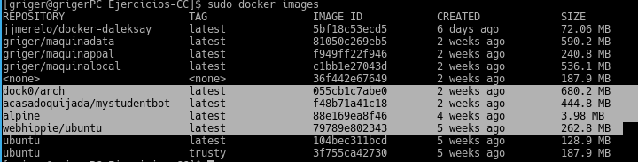

**Comparar el tamaño de las imágenes de diferentes sistemas operativos base, Fedora, CentOS y Alpine, por ejemplo.**

Aquí podemos ver los tamaños de distintas imágenes de Ubuntu, una Alpine y otra de Arch que ocupa más que la de Ubuntu, algo que creía que iba a suceder al contrario. Y es evidente que la diferencia de tamañao entre las imágenes de Ubuntu y Arch y la de Alpine es enorme, siendo esta última mucho más ligera:

